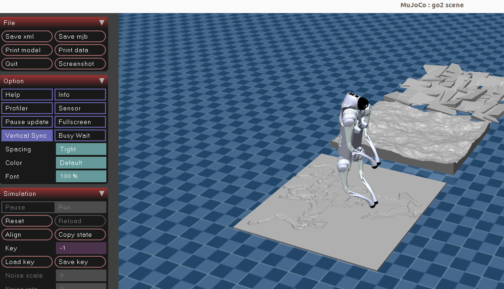
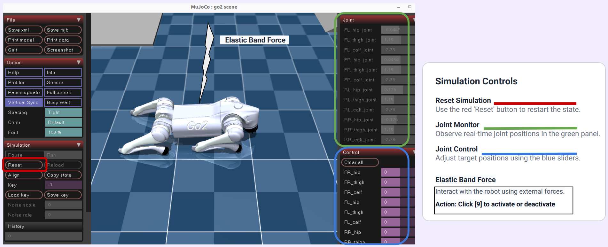
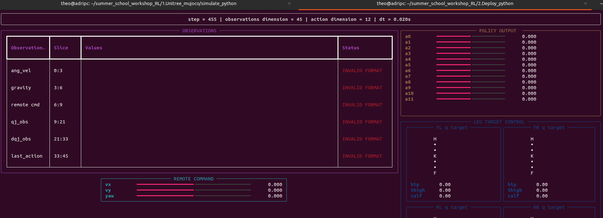
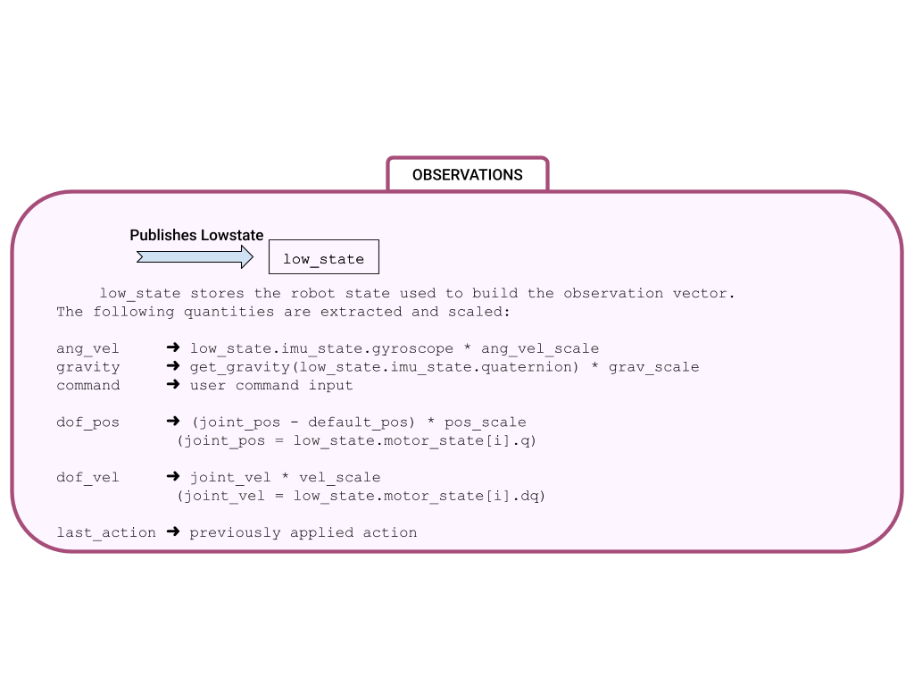
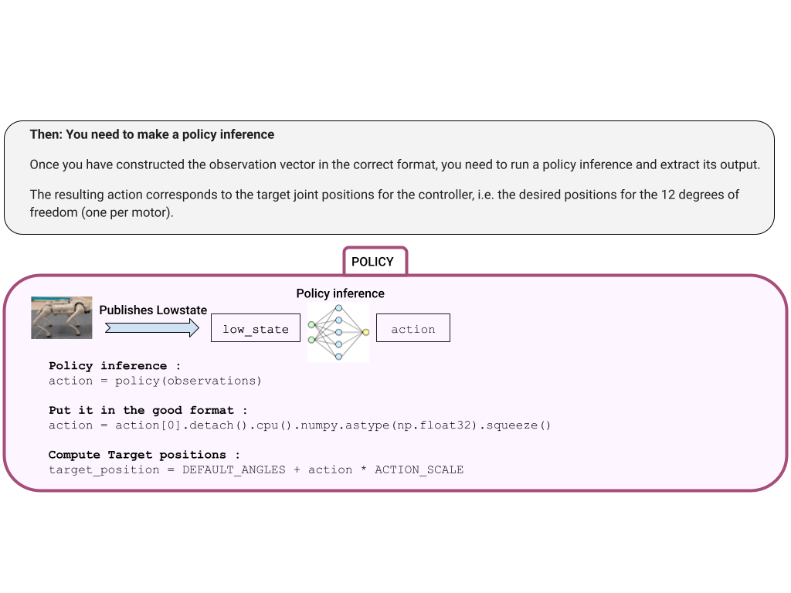
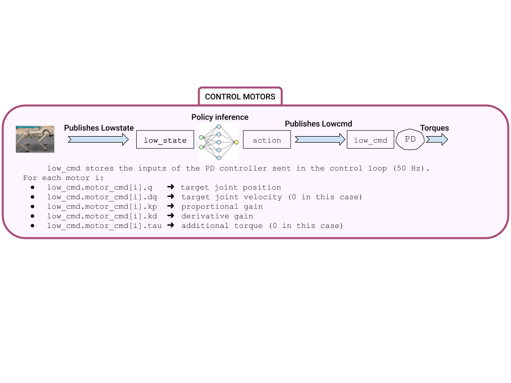
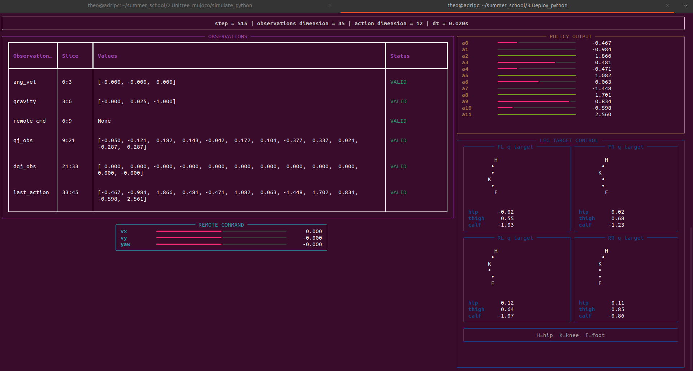

<p align="center">
  
</p>

 <p align="center">
  
  <br>
 </p>
 
# <h2 align="center">SUMMER-SCHOOL-RL-WORKSHOP</h2>

**This repository provides a Python deployment framework for the Unitree Go2 quadrupped robot, designed to run Reinforcement-Learning policies in simulation like it would be on real hardware.**
**It supports SIM-to-SIM deployment in MuJoCo, with a focus on UI control.**

**It deploys RL policies trained for locomotion**


<table align="center" style="border-collapse:collapse;">
<th style="width:30%; text-align:center;">
  <div style="display:inline-block; width:200px;">Deploy on Mujoco</div>
</th>

  <tr>
    <td style="width:30%; text-align:center;">
      
    </td>

  </tr>
</table>


---
## 📁 Architecture

```
SUMMER-SCHOOL-RL/
  ├── main.py
  ├── 1.Unitree_mujoco/
  │   ├── simulate_python
  │   ├── terrain_tool
  │   └── unitree_robots
  |
  ├── 2.Deploy_python/
  │   ├── common
  │   ├── mini_examples
  │   ├── policy
  │   ├── deploy.py
  │   └── deploy_to_fill.py
  │  
  ├── cyclonedds/
  ├── doc/
  ├── unitree_sdk2_python/
  └── README.md
```

---

---
<h2 align="center">🔧 Installation Guides🔧</h2> 

## 1️⃣ 🐍 Create & prepare the Conda environment

Create the env conda :
```bash
conda create -n go2_rl python=3.11
conda activate go2_rl
```

Install libraries :
```bash
pip install -U torch==2.7.0 torchvision==0.22.0 --index-url https://download.pytorch.org/whl/cu128
pip install rich
pip install scipy
```

Clone project :
```bash
cd ~/
git clone https://github.com/TheoBounac/SUMMER-SCHOOL-RL.git
```

## 2️⃣ 🤖 Install Unitree SDK2 Python

```bash
cd ~/SUMMER-SCHOOL-RL/unitree_sdk2_python
sudo apt install python3-pip
export CYCLONEDDS_HOME=~/SUMMER-SCHOOL-RL/cyclonedds/install
pip3 install -e .
```

## 3️⃣ 🏗️ Launch the Mujoco simulation

```bash
cd ~/SUMMER-SCHOOL-RL/1.Unitree_mujoco
pip3 install mujoco
pip3 install pygame
python simulate_python/unitree_mujoco.py
```
You should see :

 <p align="center">
  
  <br>
 </p>

<p align="center">
Press <kbd>9</kbd> to deactivate the elastic band and <kbd>7</kbd> / <kbd>8</kbd> to raise / lower the robot.
</p>
 
You should see :
 <p align="center">
  
  <br>
 </p>
 


---
## 4️⃣ 🚀 Launch the deploy.py code

In an other terminal:
```bash
conda activate go2_rl
cd ~/SUMMER-SCHOOL-RL/2.Deploy_python
python deploy.py
```
You should see :
 <p align="center">
  
  <br>
 </p>

You can also launch the code without this graphic panel with `--debug`:
```bash
conda activate go2_rl
cd ~/SUMMER-SCHOOL-RL/2.Deploy_python
python deploy.py --debug
```

---


Now you must follow the tasks and fill the `deploy.py` file:

<div align="center">
  <br>
  <br>
  
</div>


When you completed all the tasks, the robot should walk and you should see :
 <p align="center">
  
  <br>
 </p>
 
---

##  Links

These are the repositories we used for this workshop :

| 🔗 Resources | 📍 Link |
|--------------|---------|
|  **IsaacLab (NVIDIA)** | [https://github.com/isaac-sim/IsaacLab](https://github.com/isaac-sim/IsaacLab) |
|  **Unitree SDK2 Python** | [https://github.com/unitreerobotics/unitree_sdk2_python](https://github.com/unitreerobotics/unitree_sdk2_python) |
|  **unitree_rl_lab** | [https://github.com/unitreerobotics/unitree_rl_lab](https://github.com/unitreerobotics/unitree_rl_lab) |
|  **Mujoco** | [https://github.com/unitreerobotics/unitree_mujoco](https://github.com/unitreerobotics/unitree_mujoco) |


---

## 👥 Author & Contributors

**Author:**  
Théo Bounaceur  
Laboratory **LORIA** (CNRS / University of Lorraine), Nancy, France  
🧬 Field: Reinforcement Learning · Unitree robots · IsaacLab · IsaacGym · ROS 2 · Unitree SDK2  
📫 Contact: theo.bounaceur@loria.fr  (do not hesitate to contact me)

**Supervisors / Advisors:**  
- Adrien Guenard  
- Cyril Regan  
