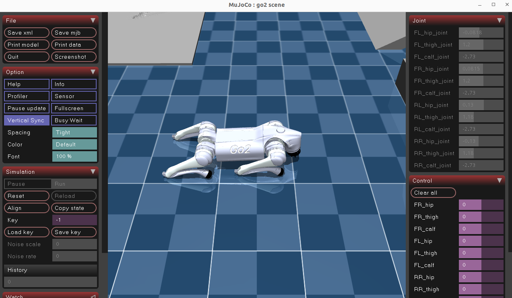
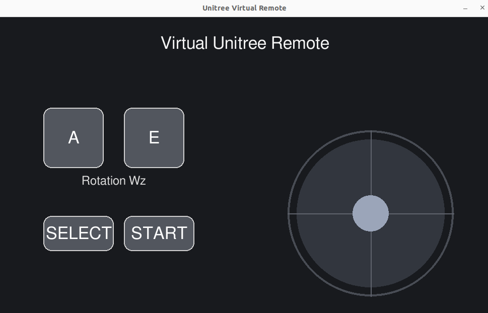

# <h2 align="center">SUMMER-SCHOOL-RL</h2> 
 <p align="center">
  
  <br>
 </p>
 
# <h2 align="center">G1 RL Deploy Python</h2>

**This repository provides a Python deployment framework for the Unitree G1 humanoid robot, designed to run reinforcement-learning policies both in simulation and on real hardware.**
**It supports SIM-to-SIM deployment in MuJoCo as well as SIM-to-REAL execution on the physical G1 robot, with a focus on UI control and safety during deployment.**

**It deploys RL policies trained for locomotion and teleoperated whole-body control.**


<table align="center" style="border-collapse:collapse;">
<th style="width:50%; text-align:center;">
  <div style="display:inline-block; width:200px;">Deploy on Mujoco</div>
</th>

  <tr>
    <td style="width:50%; text-align:center;">
      
    </td>

  </tr>
</table>


---
## Project overview

This project implements a complete deployment guide:

 - 🎮 How to deploy Reinforcement Learning (RL) policies in **Mujoco**

 - 🤖 How to deploy models on the **real G1 robot** via  Unitree SDK

Reinforcement Learning models are trained with : [unitree_rl_lab](https://github.com/unitreerobotics/unitree_rl_lab) for Locomotion, and [TWIST](https://github.com/YanjieZe/TWIST) for Teleoperated Whole-Body Control. 

The project combines **Python + Unitree SDK + Mujoco + IsaacLab + Unitree_rl_lab + Twist**, enabling the deployment of RL policies on the real robot with an Interactive **UI** and **Safety measures**.

---
## 📁 Architecture

```
G1_deploy_python/
├── main.py
├── controller/
│   ├── buttons.py
│   ├── controller.py
│   ├── security.py
│   ├── server_high_level_motion_lib.py
│   └── UI.py
├── states/
│   ├── fsm.py
│   ├── base_state.py
│   ├── state_passive.py
│   ├── state_default_static.py
│   ├── state_velocity.py
│   ├── state_mocap.py
│   └── emergency.py
├── policies/
│   └── locomotion_policies/
│   └── mimici_policies/
├── mocap_files/
├── doc/
├── common/
└── assets/
```

---

---
<h2 align="center">🔧 Installation Guides🔧</h2> 

## 1️⃣ 🐍 Create & prepare the Conda environment

Create the env conda :
```bash
conda create -n go2_rl python=3.11
conda activate go2_rl
```

Install libraries :
```bash
pip install -U torch==2.7.0 torchvision==0.22.0 --index-url https://download.pytorch.org/whl/cu128
pip install rich
pip install scipy
```

Clone project :
```bash
cd ~/
git clone https://github.com/TheoBounac/SUMMER-SCHOOL-RL.git
```

## 2️⃣ 🤖 Install Unitree SDK2 Python

```bash
cd ~/SUMMER-SCHOOL-RL/unitree_sdk2_python
sudo apt install python3-pip
export CYCLONEDDS_HOME=~/SUMMER-SCHOOL-RL/cyclonedds/install
pip3 install -e .
```

## 3️⃣ 🏗️ Launch the Mujoco simulation

```bash
cd ~/SUMMER-SCHOOL-RL/1.Unitree_mujoco
pip3 install mujoco
pip3 install pygame
python simulate_python/unitree_mujoco_virtual_remote_ui2.py
```
You should see :

 <p align="center">
  
  <br>
 </p>
 
You should see :
 <p align="center">
  
  <br>
 </p>
 
Press `9` to deactivate the elastic band and `7` / `8` to raise / lower the robot.

---
## 4️⃣ 🚀 Launch the deploy.py code

```bash
cd ~/SUMMER-SCHOOL-RL/2.Deploy_python
python deploy.py
```


---

##  Links

These are the repositories I used for my project :

| 🔗 Resources | 📍 Link |
|--------------|---------|
|  **IsaacLab (NVIDIA)** | [https://github.com/isaac-sim/IsaacLab](https://github.com/isaac-sim/IsaacLab) |
|  **Unitree SDK2 Python** | [https://github.com/unitreerobotics/unitree_sdk2_python](https://github.com/unitreerobotics/unitree_sdk2_python) |
|  **unitree_rl_lab** | [https://github.com/unitreerobotics/unitree_rl_lab](https://github.com/unitreerobotics/unitree_rl_lab) |
|  **TWIST** | [https://github.com/YanjieZe/TWIST](https://github.com/YanjieZe/TWIST) |


---

## 👥 Author & Contributors

**Author:**  
Théo Bounaceur  
Laboratory **LORIA** (CNRS / University of Lorraine), Nancy, France  
🧬 Field: Reinforcement Learning · Unitree robots · IsaacLab · IsaacGym · ROS 2 · Unitree SDK2  
📫 Contact: theo.bounaceur@loria.fr  (do not hesitate to contact me)

**Supervisors / Advisors:**  
- Adrien Guenard  
- Cyril Regan  
