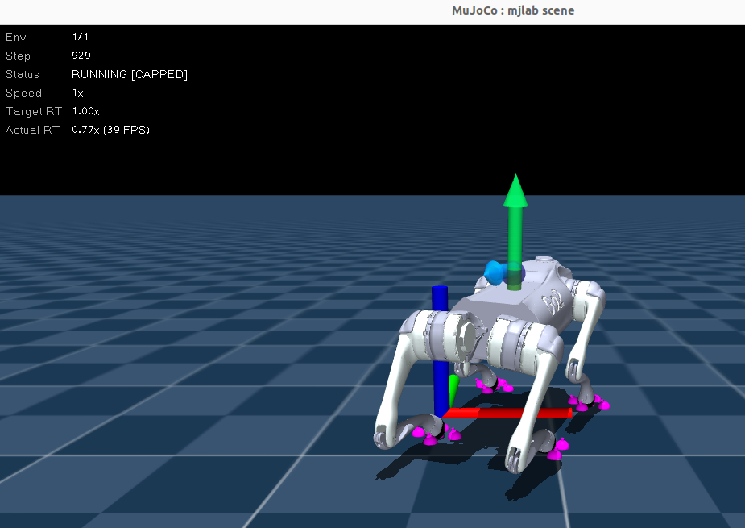

<p align="center">
  
</p>

 <p align="center">
  
  <br>
 </p>
 
# <h2 align="center">SUMMER-SCHOOL-RL-WORKSHOP</h2>

**RL Locomotion tutorial with Unitree Go2 in The AI for Human–Robot Interaction summer school which will be held at the Loria and Inria Center at the Université de Lorraine, in Nancy (France) from July 6th to 10th of 2026.**

**This repository provides a Python training/deployment framework for the Unitree Go2 quadrupped robot, designed to train Reinforcement-Learning policies and deploy them in MuJoCo exactly like it would be on real hardware.**


<table align="center" style="border-collapse:collapse;">
<th style="width:30%; text-align:center;">
  <div style="display:inline-block; width:100px;">Train on Mjlab</div>
</th>

  <tr>
    <td style="width:30%; text-align:center;">
      
    </td>

  </tr>
</table>

<table align="center" style="border-collapse:collapse;">
<th style="width:30%; text-align:center;">
  <div style="display:inline-block; width:200px;">Deploy on Mujoco</div>
</th>

  <tr>
    <td style="width:30%; text-align:center;">
      
    </td>

  </tr>
</table>


---
## 📁 Architecture

```
SUMMER-SCHOOL-RL/
  ├── 1.Training/
  │     ├── unitree_go2/
  │     │    ├── xmls
  │     │    └── go2_constants.py
  │     │
  │     └── unitree_go2_velocity/
  │         ├── env_cfg.py
  │         ├── rl_cfg.py
  │         └── runner.py
  │     
  ├── 2.Deploy/
  │     ├── Unitree_mujoco/
  │     │    ├── simulate_python
  │     │    ├── terrain_tool
  │     │    └── unitree_robots
  │     │
  │     ├── Deploy_python/
  │     │   ├── common
  │     │   ├── mini_examples
  │     │   ├── policy
  │     │   ├── deploy.py
  │     │   └── deploy_to_fill.py
  │     │
  │     ├── cyclonedds
  │     └── unitree_sdk2_python
  ├── doc/
  ├── docker/
  └── README.md
```

---


# 🐳 Docker Installation
**Part 1** : [📘 How to train Reinforcement Learning (RL) policies on **IsaacLab Simulation**](doc/Isaaclab.md)

# 🐳 Docker Installation
**Part 1** : [📘 How to train Reinforcement Learning (RL) policies on **IsaacLab Simulation**](doc/Isaaclab.md)

---

##  Links

These are the repositories we used for this workshop :

| 🔗 Resources | 📍 Link |
|--------------|---------|
|  **IsaacLab (NVIDIA)** | [https://github.com/isaac-sim/IsaacLab](https://github.com/isaac-sim/IsaacLab) |
|  **Unitree SDK2 Python** | [https://github.com/unitreerobotics/unitree_sdk2_python](https://github.com/unitreerobotics/unitree_sdk2_python) |
|  **unitree_rl_lab** | [https://github.com/unitreerobotics/unitree_rl_lab](https://github.com/unitreerobotics/unitree_rl_lab) |
|  **Mujoco** | [https://github.com/unitreerobotics/unitree_mujoco](https://github.com/unitreerobotics/unitree_mujoco) |
|  **Mjlab** | [https://github.com/mujocolab/mjlab](https://github.com/mujocolab/mjlab) |


---

## 👥 Authors & Contributors

**Author:**  
Théo Bounaceur & Ioannis Loizou (phd student)  
Laboratory **LORIA** (CNRS / University of Lorraine), Nancy, France  
🧬 Field: Reinforcement Learning · Unitree robots · IsaacLab · IsaacGym · ROS 2 · Unitree SDK2  
📫 Contact: theo.bounaceur@loria.fr  (do not hesitate to contact me)

**Supervisors / Advisors:**  
- Adrien Guenard  
- Cyril Regan
- Serena Ivaldi  
