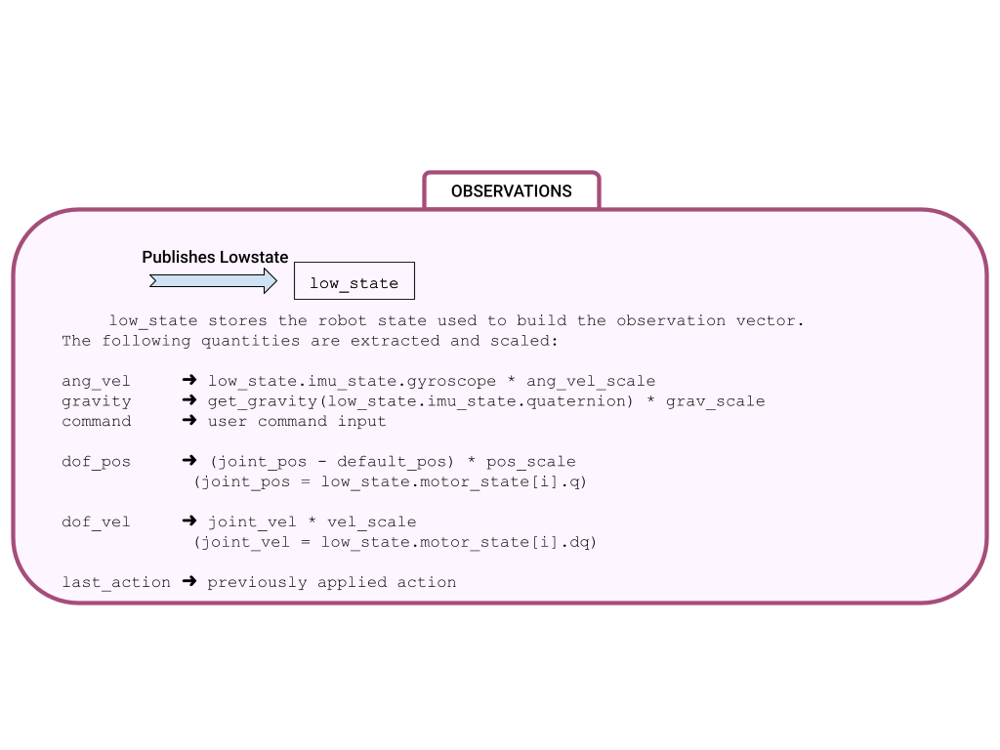
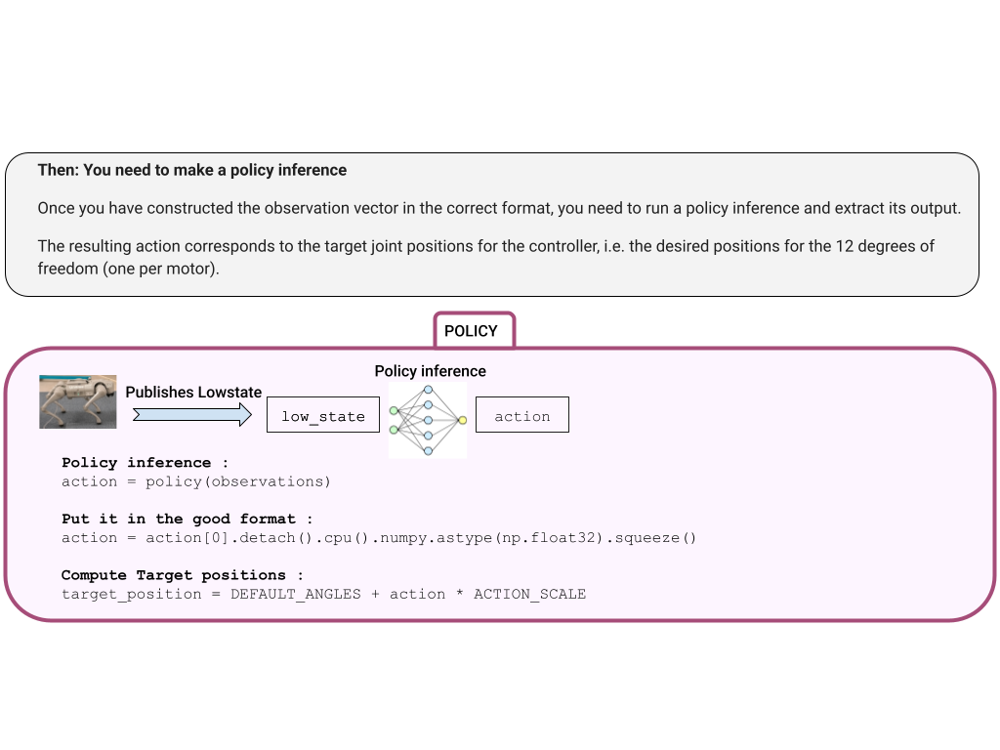
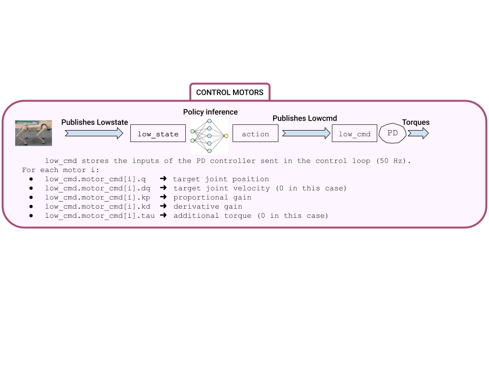

# 🤖 Deployment

## 1️⃣ Launch the MuJoCo simulator

Inside the container:

```bash
cd /workspace/SUMMER-SCHOOL-RL/2.Deploy

python Unitree_mujoco/simulate_python/unitree_mujoco.py
```

---

## 2️⃣ Open a second terminal inside the same container

On the host machine:

```bash
docker ps
```

Copy the container name, then run:

```bash
docker exec -it CONTAINER_NAME bash
```

Example:

```bash
docker exec -it summer-school-rl bash
```

---

## 3️⃣ Launch the deployment script

Inside the second Docker terminal:

```bash
cd /workspace/SUMMER-SCHOOL-RL/2.Deploy

python Deploy_python/deploy.py
```

Or without the dashboard:

```bash
python Deploy_python/deploy.py --debug
```


## 3️⃣ 🏗️ Launch the Mujoco simulation

```bash
pip3 install mujoco
pip3 install pygame
python SUMMER-SCHOOL-RL/1.Unitree_mujoco/simulate_python/unitree_mujoco.py
```
You should see :

 <p align="center">
  
  <br>
 </p>

<p align="center">
Press <kbd>9</kbd> to deactivate the elastic band and <kbd>7</kbd> / <kbd>8</kbd> to raise / lower the robot.
</p>
 
You should see :
 <p align="center">
  
  <br>
 </p>
 


---
## 4️⃣ 🚀 Launch the deploy.py code

In an other terminal (also export cyclonedds):
```bash
conda activate go2_rl
export CYCLONEDDS_HOME=~/SUMMER-SCHOOL-RL/cyclonedds/install
python SUMMER-SCHOOL-RL/2.Deploy_python/deploy.py
```
You should see :
 <p align="center">
  
  <br>
 </p>

You can also launch the code without this graphic panel with `--debug`:
```bash
conda activate go2_rl
python SUMMER-SCHOOL-RL/2.Deploy_python/deploy.py --debug
```

---


Now you must follow the tasks and fill the `deploy.py` file:

<div align="center">
  <br>
  <br>
  
</div>


When you completed all the tasks, the robot should walk and you should see :
 <p align="center">
  
  <br>
 </p>

---
