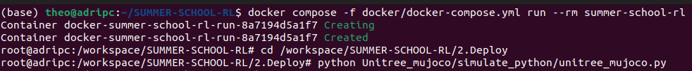
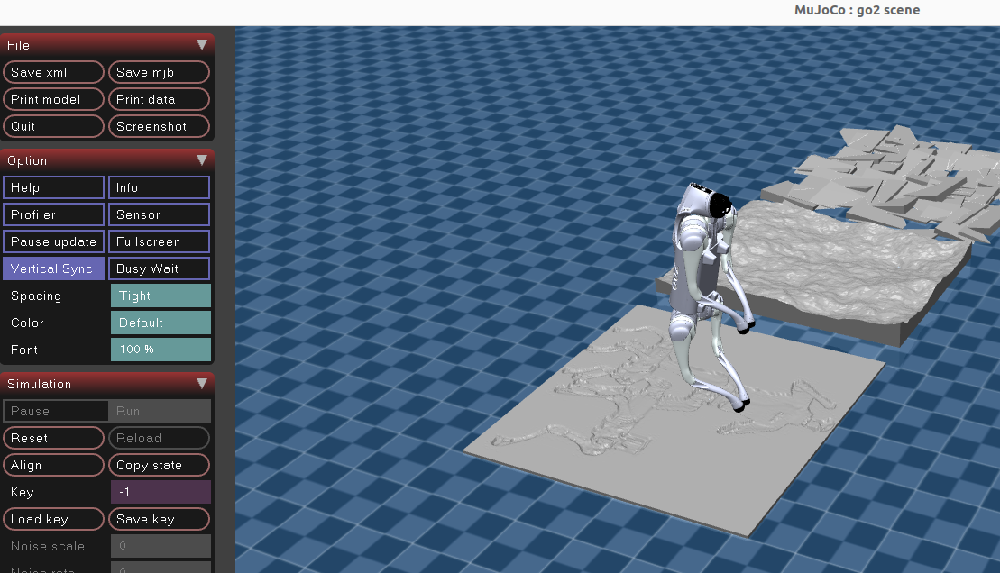
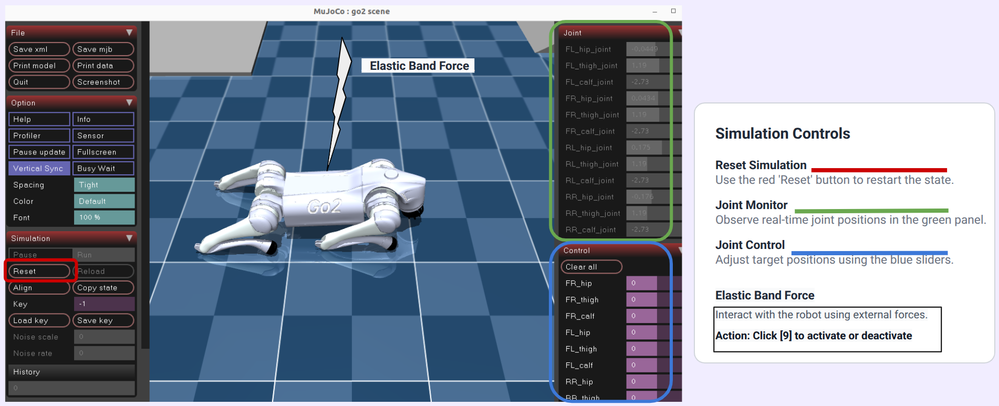
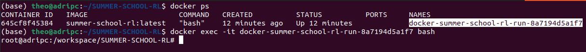
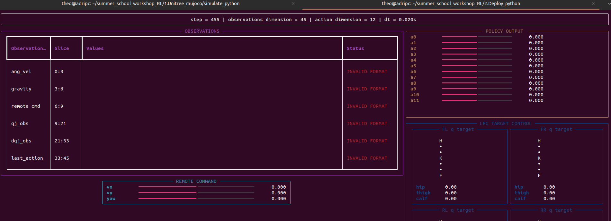
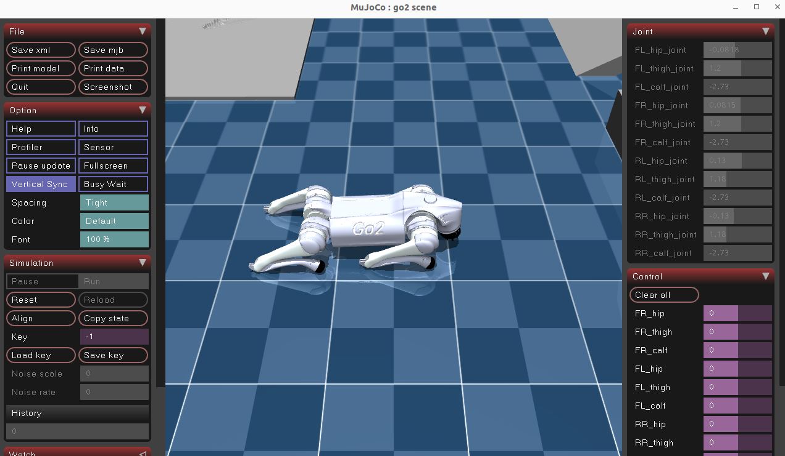
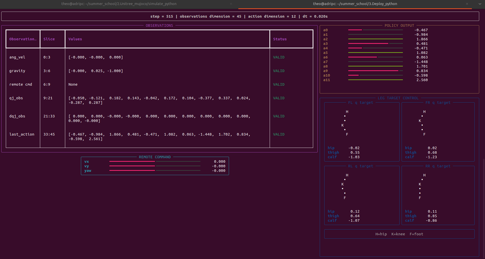

# 🤖 Deployment
(Make sure you completed the docker installation)

## 1️⃣ 🏗️ Launch the MuJoCo simulator

Inside the container:

```bash
cd /workspace/SUMMER-SCHOOL-RL/2.Deploy

python Unitree_mujoco/simulate_python/unitree_mujoco.py
```
 <p align="center">
  
  <br>
 </p>
 
You should see :

 <p align="center">
  
  <br>
 </p>
 <p align="center">
The robot is hold by an invisible elastic band :
  
Press <kbd>9</kbd> to activate or deactivate the elastic band. When activated you can change the force of the elastic: SPAM <kbd>7</kbd> to raise, and SPAM <kbd>8</kbd>  to lower the robot.
</p>

Press <kbd>RESET</kbd> button in the menu at the left, to reset the robot position (make sure the elastic band is deactivate by pressing <kbd>9</kbd> on your keyboard).

See the command instruction guide for MuJoCo:
 <p align="center">
  
  <br>
 </p>
 
---

## 2️⃣ Open a second terminal inside the same container

On the host machine:

```bash
docker ps
```

Copy the container name, then run:

```bash
docker exec -it CONTAINER_NAME bash
```

Example:

```bash
docker exec -it docker-summer-school-rl-run-8a7194d5a1f7 bash
```
 <p align="center">
  
  <br>
 </p>
 
---

## 3️⃣ Launch the deployment script

Inside the second Docker terminal:

```bash
cd /workspace/SUMMER-SCHOOL-RL/2.Deploy

python Deploy_python/deploy.py
```
You should see :
 <p align="center">
  
  <br>
 </p>
 
Or without the dashboard with with `--debug`:

```bash
python Deploy_python/deploy.py --debug
```

At the begining, the deploy file does not work well until you complete the workshop. So the robot will just fall after standing up:

 <p align="center">
  
  <br>
 </p>
 
## 4️⃣ 🚀 Complete the workshop

This is the end of the preparation. 
During the summer school week, students will be asked to do the tasks required to train and deploy a policy for the Go2 locomotion.
When you complete all the tasks, the robot should walk and you should see :
 <p align="center">
  
  <br>
 </p>

<table align="center" style="border-collapse:collapse;">
<th style="width:30%; text-align:center;">
  <div style="display:inline-block; width:200px;">Deploy file completed</div>
</th>

  <tr>
    <td style="width:30%; text-align:center;">
      
    </td>

  </tr>
</table>

---
