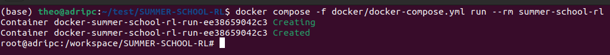
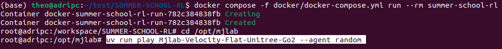
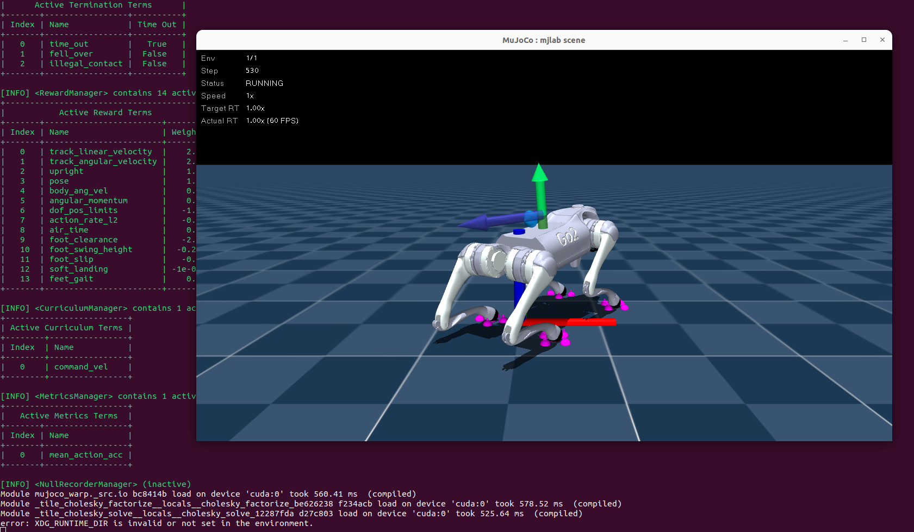
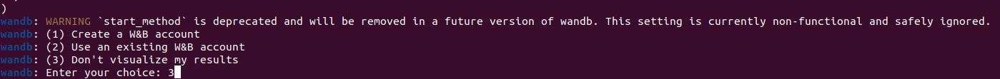
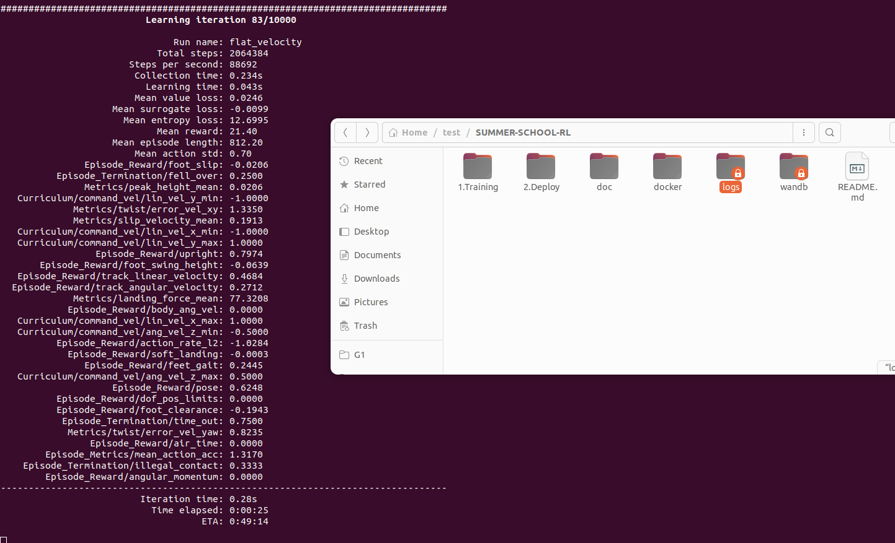

# 🏋️ Training (MJLab)
(Make sure you completed the docker installation)

Inside the container, go to the MJLab workspace:

```bash
cd /opt/mjlab
```
You should see:
<p align="center">
  
</p>

---

Launch the Go2 environment with a random policy:

```bash
uv run play Mjlab-Velocity-Flat-Unitree-Go2 --agent random
```
You should see:
<p align="center">
  
  
</p>

---

You can try to launch the training script which is incompleted (students will complete it during the summer shcoool)
Start training:

```bash
uv run train Mjlab-Velocity-Flat-Unitree-Go2 --env.scene.num-envs 1024
```
Enter choice 3:
<p align="center">
  
</p>

You should see the logs:
<p align="center">
  
</p>
